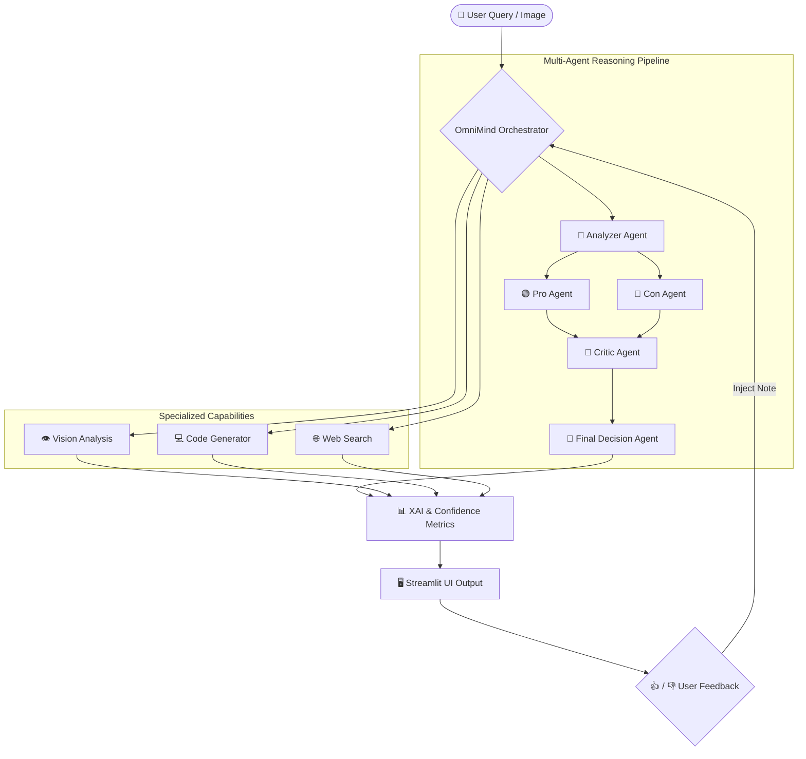

# 🧠 OmniMind: Autonomous Multi-Agent Intelligence System

[](https://www.python.org/)
[](https://streamlit.io/)
[](https://python.langchain.com/)
[](https://ai.google.dev/)
[](LICENSE)

> **OmniMind** is a state-of-the-art, multi-modal Conversational AI and Multi-Agent Reasoning platform built with Streamlit, LangChain, and Google Gemini 2.5 Flash. It orchestrates a suite of 5 autonomous specialized agents to conduct deep multi-perspective debates, perform web research, generate production-grade software, analyze visual data, and provide explainable decision metrics.

---

## 🌟 Key Features

* 🤖 **5-Agent Autonomous Collective**:
  * 🎯 **Analyzer Agent**: Deconstructs complex queries into core parameters.
  * 🟢 **Pro Agent**: Formulates compelling supportive arguments and potential benefits.
  * 🔴 **Con Agent**: Identifies critical risks, drawbacks, and counterpoints.
  * 🧐 **Critic Agent**: Reviews arguments for bias, logical fallacies, and empirical validity.
  * 👑 **Decision Agent**: Synthesizes all perspectives into a definitive, actionable verdict.
* 👁️ **Multi-Modal Vision Analysis**: Processes and reasons over uploaded PNG/JPG visual inputs using Gemini Vision models.
* 🌐 **Web Research & Search**: Real-time factual inquiry and analytical deductions.
* 💻 **Software Engineering Code Generation**: Stateful code synthesis, bug-fixing, and system architecture design.
* 📊 **Explainable AI (XAI) & Dynamic Confidence System**: Calculates real-time confidence scores (%) and provides explicit logical justifications for every decision.
* 🔄 **Self-Learning Iterative Feedback**: Integrated user feedback mechanism (thumbs up/down) that dynamically updates system memory to refine subsequent reasoning steps.
* 🎨 **Futuristic UI/UX**: Sleek dark gradient styling, glassmorphism cards, response timer metrics, and interactive sidebar session management.

---

## 🏗️ System Architecture



---

## 🛠️ Tech Stack

| Component | Technology | Purpose |
| :--- | :--- | :--- |
| **Frontend UI** | [Streamlit](https://streamlit.io/) + Custom CSS3 | Modern glassmorphism UI & real-time interface |
| **Orchestration** | [LangChain](https://python.langchain.com/) | Agent prompting, chain construction, and memory |
| **LLM Engine** | Google Gemini 2.5 Flash | High-speed multi-modal reasoning and code generation |
| **Database** | SQLite3 | User authentication and persistent conversation history |
| **State Management**| `python-dotenv` & Streamlit Session State | Secure API configuration and state retention |

---

## 📁 Repository Structure

```
OmniMind/
├── .streamlit/
│   └── config.toml          # Custom theme and Streamlit configuration
├── agents.py                # LangChain multi-agent pipeline logic & prompts
├── app.py                   # Streamlit web application & interactive UI
├── database.py              # SQLite3 database interface for users & history
├── styles.css               # Futuristic dark-theme glassmorphism styling
├── luffy_icon.png           # Custom avatar asset
├── requirements.txt         # Python project dependencies
├── .env.example             # Template for required environment variables
├── .gitignore               # Ignored files (virtual environment, DB, secrets)
├── OmniMind_Project_Documentation.txt # Detailed architecture guide
└── README.md                # Project documentation
```

---

## 🚀 Quick Start Guide

### Prerequisites
* **Python 3.9+** installed on your system.
* A **Google Gemini API Key** (obtainable from [Google AI Studio](https://aistudio.google.com/)).

### Installation

1. **Clone the Repository**
   ```bash
   git clone https://github.com/PremVishal21/OmniMind.git
   cd OmniMind
   ```

2. **Create and Activate a Virtual Environment**
   * **Windows (PowerShell):**
     ```powershell
     python -m venv .venv
     .\.venv\Scripts\Activate.ps1
     ```
   * **Linux / macOS:**
     ```bash
     python3 -m venv .venv
     source .venv/bin/activate
     ```

3. **Install Dependencies**
   ```bash
   pip install -r requirements.txt
   ```

4. **Configure Environment Variables**
   Copy `.env.example` to `.env` and add your API key:
   ```bash
   cp .env.example .env
   ```
   *Or enter your Google Gemini API key directly into the application's sidebar settings during execution.*

5. **Run the Application**
   ```bash
   streamlit run app.py
   ```

---

## 🎮 Sample Demo Prompts

Try feeding OmniMind complex dilemmas to watch the multi-agent collective in action:
* *Should humanity prioritize terraforming Mars or restoring Earth's ecosystems?*
* *What are the economic and societal impacts of implementing a Universal Basic Income (UBI)?*
* *Should artificial intelligence agents be granted legal personhood and intellectual property rights?*
* *Perform a complete code review and optimization for an asynchronous Python WebSockets server.*

---

## 📄 License

This project is licensed under the **MIT License**. See the `LICENSE` file for details.

---

<p center>
  Made with ❤️ by <a href="https://github.com/PremVishal21">Prem Vishal</a>
</p>
